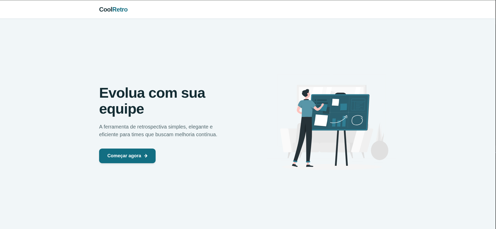
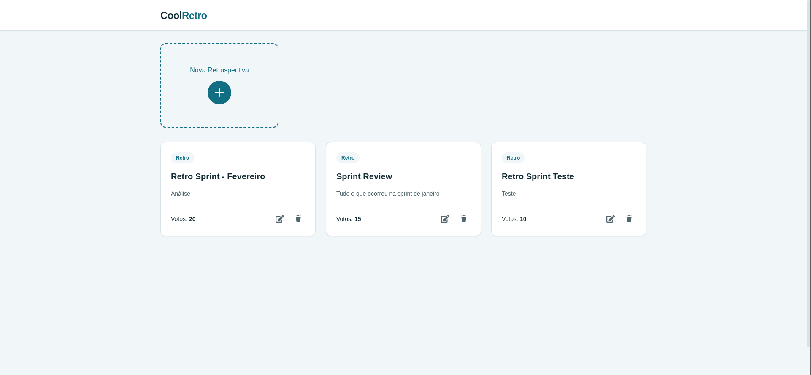
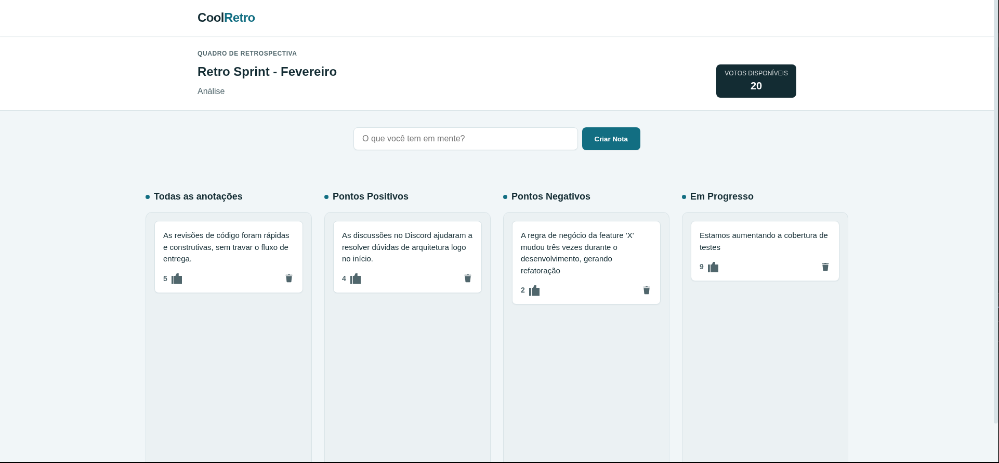
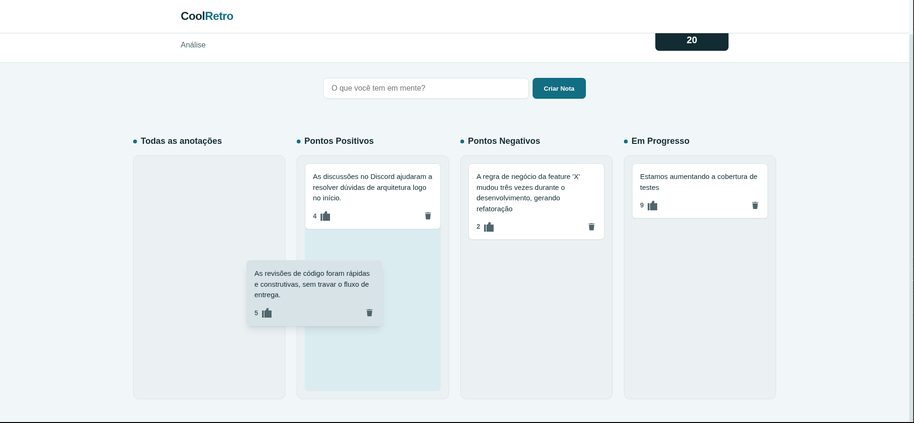

# Cool Retro - Front-end

Uma aplicação web moderna e intuitiva para gerenciar reuniões de retrospectiva de times ágeis. O **Cool Retro** permite criar quadros personalizados, adicionar notas, votar em ideias e organizar as colunas através de uma interface interativa com suporte a drag and drop.

  
  
  
  

> **Acesse o projeto:** [Cool Retro](http://cool-retro.vercel.app/)

---

## ✨ Features

- **Criação de Quadros:** Personalize suas retrospectivas com nome, descrição e limite de votos.
- **Notas Colaborativas:** Adicione notas em diferentes colunas para organizar os feedbacks do time.
- **Interatividade (Drag & Drop):** Organize suas notas livremente entre as colunas com suporte a arrastar e soltar.
- **Sistema de Votos:** Avalie as notas mais importantes para o time.
- **Gestão de Conteúdo:** Edite ou exclua notas e retrospectivas conforme necessário.
- **Feedback Visual:** Notificações em tempo real para ações do usuário.

---

## 🛠️ Tecnologias

- **Drag and Drop:** [React Beautiful Dnd](https://github.com/atlassian/react-beautiful-dnd)
- **Notificações:** [React Toastify](https://fkhadra.github.io/react-toastify/introduction/)

---

Desenvolvido por [Vinicius Soares](https://github.com/viniciussoaresbr)
